# ♥️ポーカーAI♠️

強化学習について勉強してみたかったのでポーカー（1対1）のAIを作成してみました  
最終的に、**ルールを覚えたての初心者は上回っているかな**、という強さになりました  

作成したAIと**対戦できるGUI**も作成してありますので、お試しください👍👍👍  
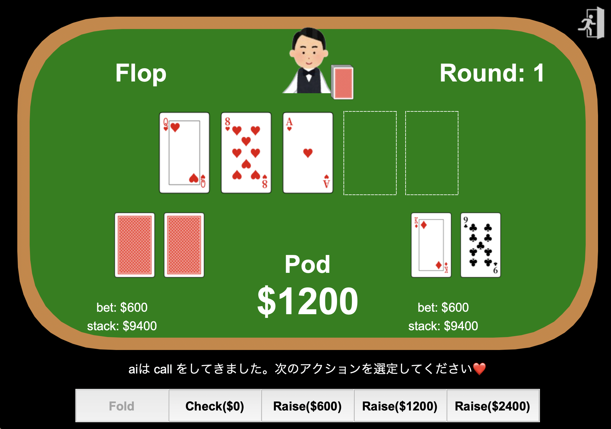

## 環境構築
- python==3.12
```bash
pip install requirements 
```
※ 学習も行いたい場合はpytorchを使用するため、cudaGPUが必要


## 強化学習の概要
使用したアルゴリズムは**方策ベースのactor-critic**  

ゲームであるため、行動価値関数を学習するDQNではなく、方策（stateに対し、最適なactionを算出する）を学習する方策ベースのアルゴリズムで作成してみた

**このアルゴリズムでは、以下の目的関数を最小化させていくように学習を進めていく**

- **目的関数**

$$ \nabla_\theta J(\theta) = \mathbb{E} \left[ \sum_{t=0}^{T} \left( R_t + \gamma V_{phase_{t+1}, w_{t+1}}(S_{t+1}) - V_{phase_t, w_t}(S_t) \right) \nabla_\theta \log \pi_\theta (A_t | S_t)\right]$$

$$R_t:報酬$$
$$V_{phase_t, w_t}(S_t):状態S_t(phase_t)での状態価値$$
$$S_t:状態変数$$
$$\pi_\theta:方策$$


この目的関数の中では**状態価値関数**(*V*)と **方策**(*π*)の二つがニューラルネットワーク(NN)であるため、この二つのNNの学習を進めることで目的関数の最小化を図る

- **状態価値関数(*V*)の損失関数(Loss)**  
$$target = R_t + \gamma V_{phase_{t+1}, w_{t+1}}(S_{t+1}) $$  
$$loss_v = target - V_{phase_t, w_t}(S_t) $$ 

- **方策(*π*)の損失関数(Loss)**  
$$target = R_t + \gamma V_{phase_{t+1}, w_{t+1}}(S_{t+1})$$  
$$loss_\pi = (target - V_{phase_t, w_t}(S_t))\nabla_\theta\log \pi_\theta (A_t | S_t) $$
$$※ loss_\pi = loss_v\nabla_\theta\log \pi_\theta (A_t | S_t) $$  

今回作成した強化学習の中で**最も工夫した点**は、
***V***と***π***をAgentがActionを起こすphaseであるpreflop, flop, turn, riverの**4つそれぞれに対し、個別に作成したことである**  

通常の強化学習では個別に作成することはないのだが、ポーカーの場合、各phaseそれぞれに対し考えるべき変数が大きく異なるため、**それぞれ個別に作成をした**

結果として、**共通の*V*と*π*の時は学習が発散していた**が、個別に作ることによって以下のように損失関数がそれぞれのphaseで**収束するようになった**


| phase|行動価値関数(***V***)|方策(***π***)|
|------------------|-----------------|-----------------|
| **preflop** | 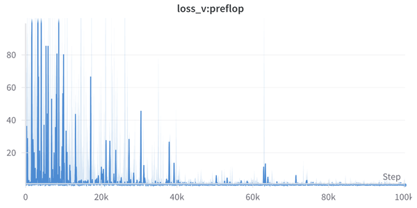 | 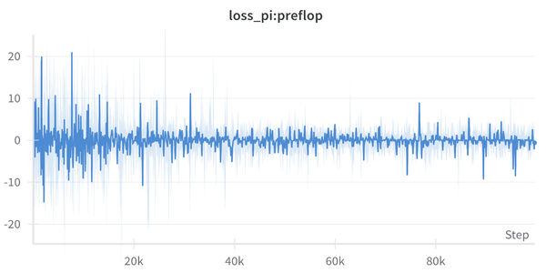 |
| **flop** | 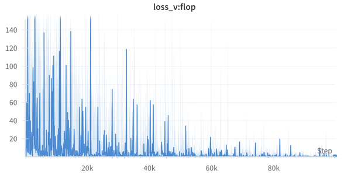 | 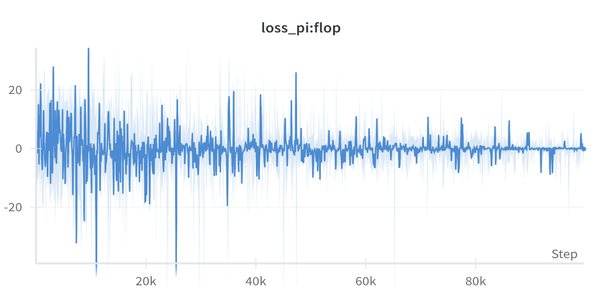 |
| **turn** | 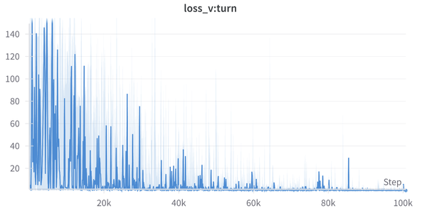 | 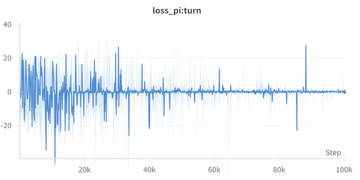 |
| **river** | 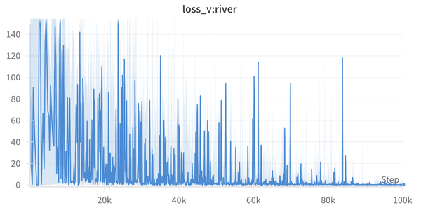 | 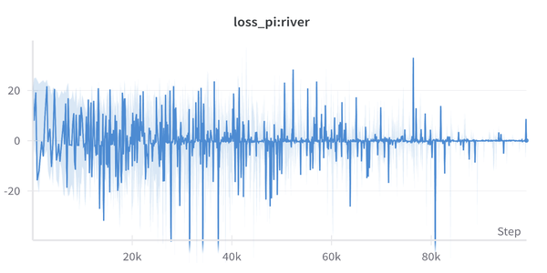 |

## RewardとStateの設定
### Reward

<table style="border-collapse: collapse; width: 100%;">
  <tr>
    <th></th>
    <th>最終的に勝てるハンド</th>
    <th>最終的に負けるハンド</th>
  </tr>
  <tr>
    <td style="font-weight: bold;">fold</td>
    <td style="text-align: left; color: red;">pod分</td>
    <td style="text-align: left; color: blue;">賭けなくて済んだ分</td>
    </td>
  </tr>
  <tr>
    <td style="font-weight: bold;">check</td>
    <td style="text-align: left;">0</td>
    <td style="text-align: left;">0</td>
  </tr>
  <tr>
    <td style="font-weight: bold;">call</td>
    <td style="text-align: left;">0</td>
    <td style="text-align: left; color: red;">新しく掛けた分</td>
  </tr>
  <tr>
    <td style="font-weight: bold;">raise</td>
    <td style="text-align: left; color: blue;">raiseで増やした掛け金分</td>
    <td style="text-align: left; color: red;">新しく掛けた分</td>
  </tr>
</table>

### State
<table style="border-collapse: collapse; width: 100%;">
  <tr>
    <th>phase</th>
    <th>個別のState</th>
    <th>共有のState</th>
  </tr>
  <tr>
    <td style="font-weight: bold;">preflop</td>
    <td style="text-align: left;"><li>2枚のhandの強さ(0~1で評価)</td>
    <td rowspan="4" style="text-align: left;">
    <li>自分の持ち点
    <li>相手の持ち点
    <li>pod
    <li>相手の掛け金
    <li>自分の掛け金
    <li>自分のアクションでphaseをやめられるか
    <li>相手のアクションの履歴
    </td>
  </tr>
  <tr>
    <td style="font-weight: bold;">flop</td>
    <td style="text-align: left;"><li>アウツ（あと一枚引くことができれば役になる）の枚数<li>現在の手札の役</td>
  </tr>
  <tr>
    <td style="font-weight: bold;">turn</td>
    <td style="text-align: left;"><li>アウツ（あと一枚引くことができれば役になる）の枚数<li>現在の手札の役</td>
  </tr>
  <tr>
    <td style="font-weight: bold;">river</td>
    <td style="text-align: left;"><li>現在の手札の役</td>
  </tr>
</table>

## 学習について
**actor_critic.ipynb**に細かく記載

※actor_critic.ipynbでは以下の4つが可能
- 学習
- 学習モデルの保存
- 過去のモデルの復元
- .onnxに変換（GPU）が必要ないモデル


## GUI操作
```bash
python -m gui.main
```
- **バトルスタイルの選択**  
   - loose（弱い手でも積極的に攻めるスタイル）
   - normal
   - tight（強い手でしか攻めてこない堅実なスタイル）
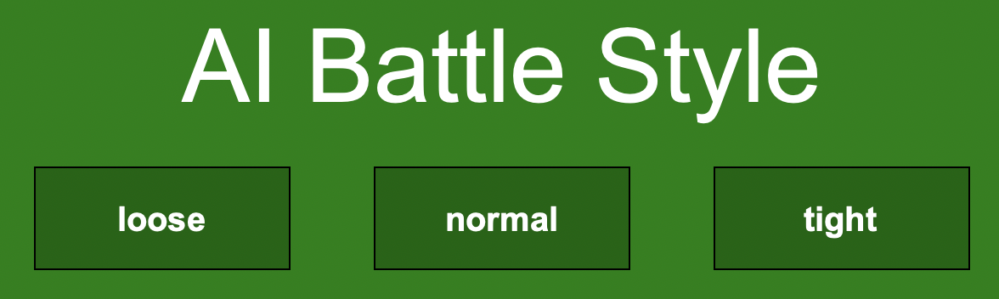  

- **各buttonでアクションを選択し、AIとバトルする**
  

- **10回のラウンドの末の持ち点で勝負を判定する**
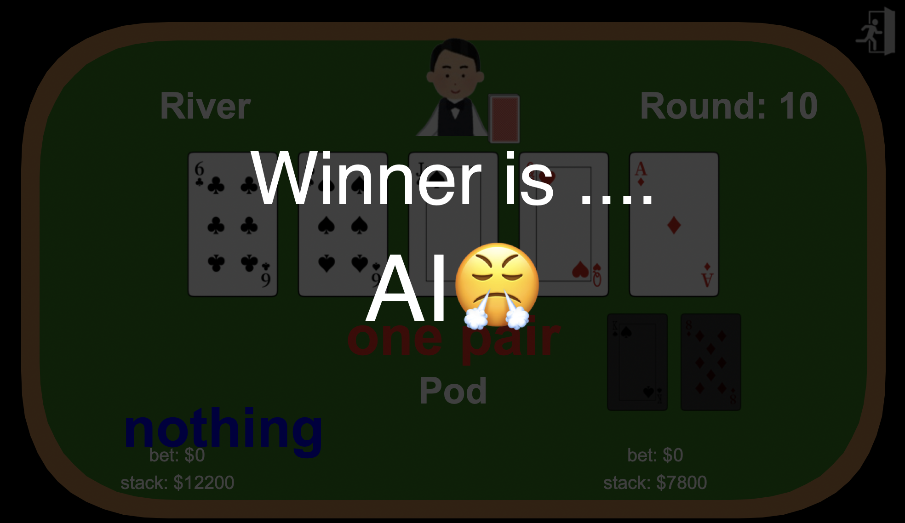  

## 今後の展望
1. アルゴリズムの変更
   ポーカーの強化学習では**CFR**というアルゴリズムが一般的らしいので、これで作成してみる  
   このCFRは選択しなかった行動の後悔値を最小化するアルゴリズムらしい
2. Rewardの設定についての吟味を深める
